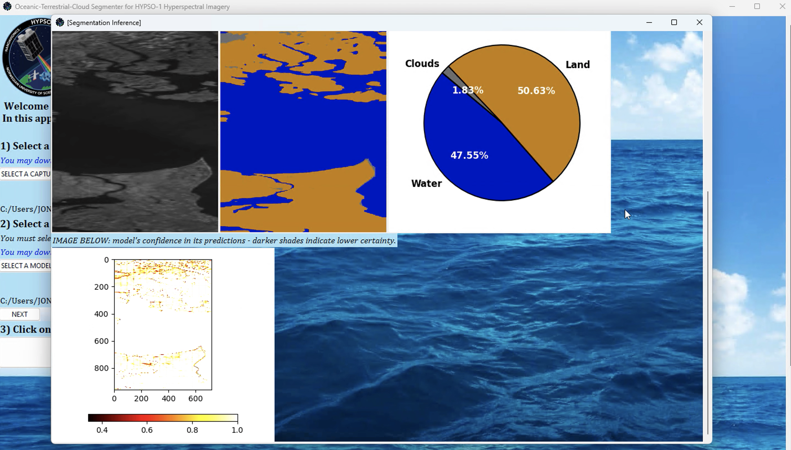

# Sea-Land-Cloud Segmentation in Satellite Hyperspectral Imagery by Deep Learning


This GitHub repository serves as the supplementary material for the paper titled *Sea-Land-Cloud Segmentation in Satellite Hyperspectral Imagery by Deep Learning*, authored by Jon Alvarez Justo, Joseph Landon Garrett, Mariana-Iuliana Georgescu, Jesus Gonzalez-Llorente, Radu Tudor Ionescu, and Tor Arne Johansen. You can access the full article by clicking [HERE](https://arxiv.org/abs/2310.16210).

We also refer to the dataset from our previous article titled *An Open Hyperspectral Dataset with Sea-Land-Cloud Ground-Truth from the HYPSO-1 Satellite*. The article can be found [HERE](https://arxiv.org/abs/2308.13679), and the dataset can be downloaded from [HERE](https://ntnu-smallsat-lab.github.io/hypso1_sea_land_clouds_dataset/). 

[Terms of use, license and citation](#Terms-of-use-and-license).


Outline:
- [Instructions: Software codes](#Software-Codes)
- [Instructions: Remaining material](#Remaining-material)
- [Software program for Oceanic-Terrestrial-Cloud segmentation on satellite hyperspectral imagery](#Software-program-Oceanic-Terrestrial-Cloud-Segmenter-HYPSO-1)
- [Terms of use and license](#Terms-of-use-and-license)
- [Citation](#Citation)


## Instructions

### Software-Codes
* *Justoetal_models_public_released.py* : It primarily comprises the model architectures (16 models), implemented with Keras and sklearn. We encourage the community to train the models on other datasets. Apple's FastViTs are found [HERE](https://github.com/apple/ml-fastvit).


* *Interactive_Python_Notebook.ipynb* : It consists of a Python notebook demonstrating how to run inference, by 1D-CNNs and 2D-CNNs, on HYPSO-1 data. In this notebook, an existing trained model file is employed for inference. The code is explained with comments. 

* *utils_for_data_handling.py* : It contains various data handling methods required by *Interactive_Python_Notebook.ipynb*.

### Remaining-material


**<big>[IMPORTANT!]: Click [HERE to access and download the remaining supplementary material](https://studntnu-my.sharepoint.com/:f:/g/personal/jonalv_ntnu_no/EsVNCjnbbIxLvm-TS67iA30BefEvoOo20GO8i5Ux9-Dp9Q?e=jmvS6S).</big>**

In this supplementary material, we include: 
* *1-EXPERIMENT RESULT FIGURES* (directory) : It includes all the experiment figures for the test set for L1b radiance and raw data, across different channel configurations. The experimental evaluation involves a set of performance metrics including average accuracy, overall accuracy, F1 score, mean absolute error, false alarm ratios, as well as both individual and average Spearman's rank correlation coefficients. Additionally, we provide the number of model parameters and inference time in our evaluations. Finally, in order to assess the models' ability to generalize effectively, we expand their testing to include inference on an additional deployment set consisting of 30 distinct, unlabeled hyperspectral images - further details on this deployment set are given below. 
* *2-TRAINED MODEL FILES* (directory) : Within this directory, there are a total of 46 models, each trained with a distinct configuration. The directory names themselves provide information about the contained model, including whether it is trained on L1b radiance or raw data, the channel configuration, and the model's name. Machine learning models are stored as *.pkl* files, while deep learning models are located within folders. Every deep learning model is uniquely identified by a type-specific identifier, such as *DEEP_LEARNING_NN_classifier_20231009_140540*. Similarly, each machine learning model is distinguished by its own identifier, like *SGD_classifier_20231003_194844*.
* *3-Training_validation_testing_split* (file) : It provides a table with information regarding the training, validation, and test data splits. The dataset is partitioned at the image level, and the table includes the image identifiers for each respective set. The image identifiers used are given by *An Open Hyperspectral Dataset with Sea-Land-Cloud Ground-Truth from the HYPSO-1 Satellite*.
* *4-Sea-Land-Cloud Data Management and Ranking System* (file) : This file consists of the flow diagram for the proposed intelligent on-board processing pipeline integrating a ranking system based on sea-land-cloud segmentation. THcl, THsea, and THland represent thresholds configured at the operations center to regulate data management during in-flight operations.
* *5-Architectures of Justo-Networks* (directory) : It includes the architecture block diagrams of the 1D-Justo-LiuNet, 1D-Justo-HuNet, 1D-Justo-LucasCNN, and 2D-Justo-UNet-Simple. 
* *6-Deployment Set (30 HS Images in L1b Radiance)* (directory) : We collect 30 unlabeled images in L1b radiance, deliberately including cloudy and overexposed images, sourced from *An Open Hyperspectral Dataset with Sea-Land-Cloud Ground-Truth from the HYPSO-1 Satellite*. This deployment set is designed to evaluate the model's generalization capabilities when confronted with further new unseen data. Inside this directory, we provide the exact images that we choose for inclusion in the deployment set. For each capture, both its L1b radiance image and its RGB composite are provided.
* *7-SOFTWARE_PROGRAM_OCEANIC_TERRESTRIAL_CLOUD_SEGMENTER_FOR_HYPSO1* (directory) : We develop a user-friendly software program for conducting the investigated Oceanic-Terrestrial-Cloud segmentation on HYPSO-1 captures. This software tool is an additional outcome of our article *Sea-Land-Cloud Segmentation in Satellite Hyperspectral Imagery by Deep Learning*. **[IMPORTANT]: Prior to downloading and utilizing the program, please adhere to the following recommended steps:**


  * In the folder *0-DEMO_WATCH_ME*, we provide a DEMO video that demonstrates how to use the segmenter. The video is named *1-DOWNLOAD_FIRST_AND_WATCH_ME_DEMO_VIDEO_HOW_TO_USE_SEGMENTER_PROGRAM.mov*. As the name implies, we recommend downloading the video first, as it is recommended to avoid using the cloud preview with lower video quality. Additionally, under *0-DEMO_WATCH_ME*, we have included several images illustrating the program's interface (also [available below](#Software-program-Oceanic-Terrestrial-Cloud-Segmenter-HYPSO-1) in this README).
  * To get started with the program, at the same directory level as *0-DEMO_WATCH_ME*, download the standalone executable file named *OCEANIC_TERRESTRIAL_CLOUD_SEGMENTER_FOR_HYPSO1.exe*. As an example, you can download the entire *Sample_files* folder, where we provide a sample HYPSO-1 capture in L1b radiance and an example of a 2D-CNN deep learning model. When you run the program, it will prompt you to provide both a L1b radiance capture and a 2D-CNN model, so you can utilize these sample files for testing and familiarization.

  Program's notice: 
  * It is compatible ONLY with the Windows operating system.
  * It supports exclusively 2D-CNN models trained as detailed in our article *Sea-Land-Cloud Segmentation in Satellite Hyperspectral Imagery by Deep Learning*.
  * As a security measure, your antivirus might attempt to block the program's execution as it is from an unrecognized developer. Allow the program to run in such cases.
  * We recommend using reasonably short local paths for both the captures and models to prevent excessively long file paths.
  * We design the program primarily for functionality and to serve as an initial desktop solution for segmentation in satellite hyperspectral imagery. Be aware that the program is not optimized for speed or efficiency. Hence, when running the program at the start, a console will first be launched, and it is advisable to wait some time for it to initialize. The initialization time will vary depending on the performance of the desktop computer where it is executed.


## Software-program-Oceanic-Terrestrial-Cloud-Segmenter-HYPSO-1

**Main window:**


**Processing and segmentation window (I):**


**Processing and segmentation window (II):**



## Terms-of-use-and-license

Users within the open community are fully permitted and encouraged to access, download, analyze, and use our data, ground-truth labels, models, and their software codes as long as proper credit is given to the authors in the [citations below](#Citation). **The present material is released under the Attribution 4.0 International (CC BY 4.0) license**. 

© 2023 Norwegian University of Science and Technology (NTNU) in Trondheim, Norway. All rights reserved.
  - by Jon Alvarez Justo, Joseph Landon Garrett, Mariana-Iuliana Georgescu, Jesus Gonzalez-Llorente, Radu Tudor Ionescu, and Tor Arne Johansen.

## Citation

**Models citation (BibTeX)** 
```
@article{justo2023sea,
  title={Sea-Land-Cloud Segmentation in Satellite Hyperspectral Imagery by Deep Learning},
  author={Justo, Jon Alvarez and Garrett, Joseph Landon and Georgescu, Mariana-Iuliana and Gonzalez-Llorente, Jesus and Ionescu, Radu Tudor and Johansen, Tor Arne},
  journal={arXiv preprint arXiv:2310.16210},
  year={2023}
}
```

Article available [HERE](https://arxiv.org/abs/2310.16210).


**Dataset citation (BibTeX)** 
```
@article{justo2023open,
  title={An Open Hyperspectral Dataset with Sea-Land-Cloud Ground-Truth from the HYPSO-1 Satellite},
  author={Justo, Jon A and Garrett, Joseph and Langer, Dennis D and Henriksen, Marie B and Ionescu, Radu T and Johansen, Tor A},
  journal={arXiv preprint arXiv:2308.13679},
  year={2023}
}
```
Article available [HERE](https://arxiv.org/abs/2308.13679) - download dataset from [HERE](https://ntnu-smallsat-lab.github.io/hypso1_sea_land_clouds_dataset/).

